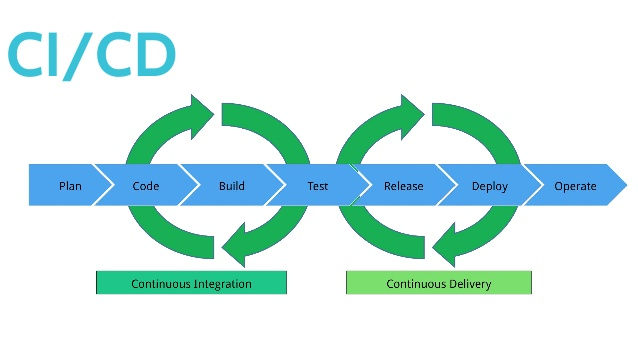

# The real DevOps challenge


### Challenge 1. The API returns a list instead of an object

#### QUESTION

As you can see, the API returns a list in the two exposed endpoints:

- `/api/v1/restaurant`: Returns a list containing all the restaurants.
- `/api/v1/restaurant/{id}`: Returns a list with a single restaurant that match the `id` path parameter.

We want to fix the second endpoint. Return a json object instead of a json array if there is a match or a http 204 status code if no match found.

#### SOLUTION

In the "search for ID" block I add a try-except structure to test the answer from MongoDB and throw a HTTP_404_NOT_FOUND error if there is a missmatch.

I use the find_one method from db class to get a json object instead a json array.

```python
try:
    result = mongo.db.restaurant.find_one(query)
    return result

except Exception as e:
    return e, status.HTTP_404_NOT_FOUND

```

### Challenge 2. Test the application in any cicd system



As a good devops engineer, you know the advantages of running tasks in an automated way. There are some cicd systems that can be used to make it happen.
Choose one, travis-ci, gitlab-ci, circleci... whatever you want. Give us a successful pipeline.

### Challenge 3. Dockerize the APP


What about containers? As this moment *(2018)*, containers are a standard in order to deploy applications *(cloud or in on-premise systems)*. So the challenge is to build the smaller image you can. Write a good Dockerfile :)

### Challenge 4. Dockerize the database


We need to have a mongodb database to make this application run. So, we need a mongodb container with some data. Please, use the [restaurant](./data/restaurant.json) dataset to load the mongodb collection before running the application.

The loaded mongodb collection must be named: `restaurant`. Do you have to write code or just write a Docker file?

### Challenge 5. Docker Compose it


Once you've got dockerized all the API components *(python app and database)*, you are ready to make a docker-compose file.
**KISS**.

### Final Challenge. Deploy it on kubernetes


If you are a container hero, an excellent devops... We want to see your expertise. Use a kubernetes system to deploy the `API`. We recommend you to use tools like [minikube](https://kubernetes.io/docs/setup/minikube/) or [microk8s](https://microk8s.io/).

Write the deployment file *(yaml file)* used to deploy your `API` *(python app and mongodb)*.
